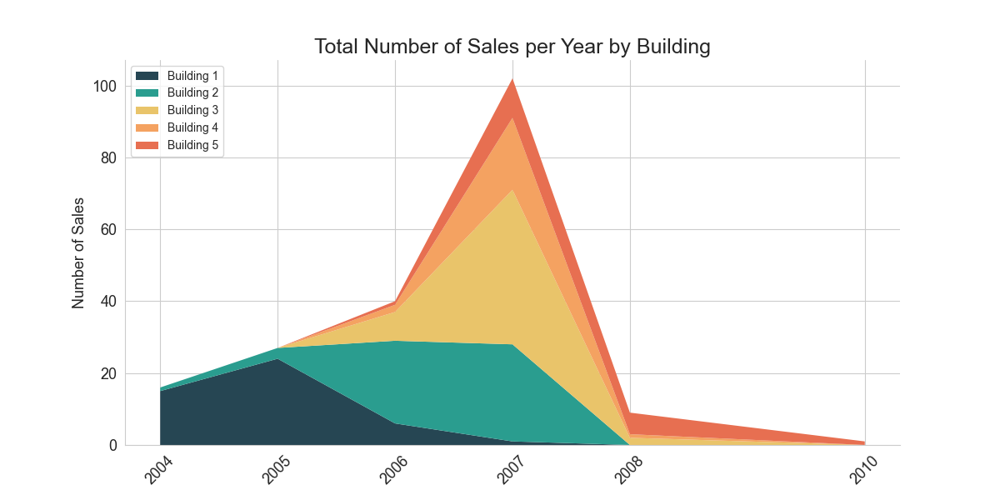
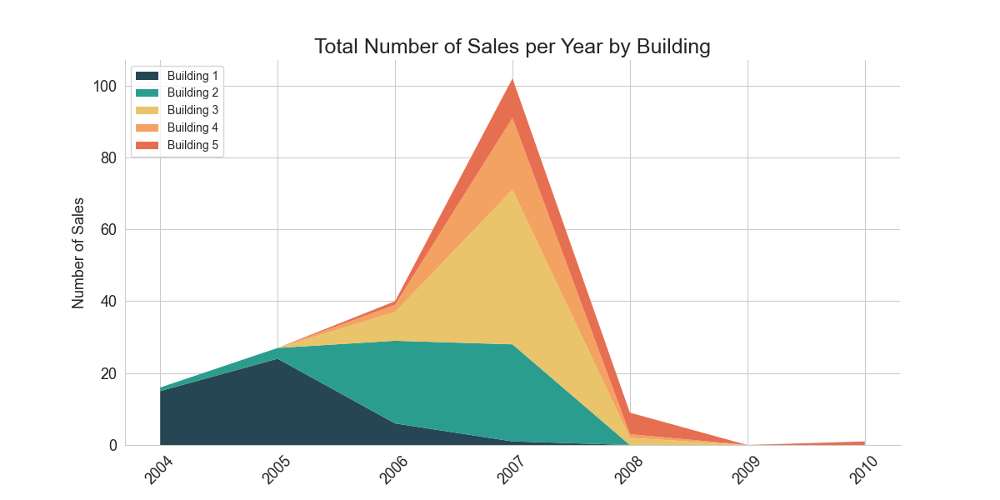

# Real Estate Market Analysis

## Business Overview
The real estate market is a multifaceted and dynamic sector of significant interest to professionals, investors, policymakers, and data analysts. A thorough understanding of market conditions and customer behavior is crucial for making informed decisions. In this Real Estate Market Analysis project, our client, a leading company in the industry, has gathered data on properties and customers, seeking insights and assistance in real estate analysis.

## Business Objective
1.   **Customer Profile**
 Develop an ideal customer profile, considering age and other characteristics, to facilitate targeted marketing efforts.

2.  **Building Characteristics:**
 Analyze building types and their characteristics to inform strategic decisions for real estate developers.

3.   **Sales by Country**
 Examine geographical data to understand the distribution of sales and identify key markets.

4.  **Total Number of Sales per Year**
 Visualize sales trends over the years to comprehend historical patterns and inform future strategies.

## Business Impact
The analysis aims to provide actionable insights for real estate owners, developers, and industry professionals, impacting marketing strategies, investment decisions, and customer targeting.

---

## Project Highlights
1.   **Customer Profile Insights**
 Understand the age distribution of customers, aiding in the creation of targeted marketing strategies.

2.   **Building Characteristics Analysis**
 Identify popular building types, average prices, and deal satisfaction to inform real estate development strategies.

3.   **Geographical Distribution**
 Analyze sales by country, revealing key markets and opportunities.

4.   **Temporal Analysis**
 Explore total sales per year, identifying trends and market fluctuations.

5.   **Data Visualization**
 Utilize charts and tables for effective communication of key findings.

## Methodology
The project involves preprocessing, analyzing, and visualizing real estate property data to derive meaningful insights. Techniques include customer segmentation, building type analysis, geographical distribution analysis, and temporal trends assessment.

## Key Components
1.   **Data Cleaning and Preprocessing**
 Ensure data quality and relevance for subsequent analysis through meticulous cleaning and preprocessing.

2.   **Statistics**
    *   **Breakdowns by Building:** Explore building-related statistics to understand their characteristics and market trends.
    *   **Breakdowns by Country and State:** Analyze sales distribution across countries and states to identify key markets.

3.   **Data Analysis**
    *   **Customers Age:** Analyze the age distribution of customers to understand demographic trends.
    *   **Analysis of the Price of Properties:** Explore property prices and identify patterns or anomalies.
    *   **Relationship Between Age and Price:** Examine the correlation between customer age and property prices.

4.   **Data Visualization**
    *   **Deal Satisfaction Across Countries:** Visualize deal satisfaction levels across different countries.
    *   **Customer Age Distribution:** Present a graphical representation of the age distribution of customers.
    *   **Segmentation by State:** Explore customer segmentation based on states.
    *   **Total Sales per Year:** Visualize the total number of sales per year to identify trends.
    *   **Yearly Sales Distribution Across Buildings:** Examine the distribution of sales across different building types each year.

## Data Dictionary
> **Properties**

|variable                       |class     |description |
|:------------------------------|:---------|:-----------|
id           |int64| unique identifier for each property
building     |int64| building type or category
date_sale    |object| date when the property was sold
type         |object| type or category of the property
property#    |int64| unique identifier for each property (property number)
area         |float64| area size of the property
price        |object| sale price of the property
status       |object| current status of the property (e.g., available, sold)
customerid   |object| unique identifier for the customer associated with the property

> **Customers**

|variable                       |class     |description |
|:------------------------------|:---------|:-----------|
customerid          |object| unique identifier for each customer
entity              |object| legal entity or individual customer
name                |object| customer's first name
surname             |object| customer's last name
birth_date          |object| date of birth of the customer
sex                 |object| gender of the customer
country             |object| country of residence for the customer
state               |object| state or region of residence for the customer
purpose             |object| purpose of the customer's engagement or interaction
deal_satisfaction   |int64| level of satisfaction with deals or transactions
mortgage            |object| mortgage information for the customer
source              |object| source of the customer's information or engagement

## Dependencies
*   `pip install pandas`
*   `pip install numpy`
*   `pip install matplotlib`
*   `pip install datetime`
*   `pip install seaborn`

---

## Result Interpretation
After meticulous preprocessing, analysis, and visualization, it is crucial to discuss the relevance of this analysis and problem setting and for whom it is valuable.

### Customer Profile
Understanding customer profiles allows real estate owners and developers to identify potential buyers. However, there is a challenge: demand often surpasses affordable housing availability in many US and European cities. While targeting the ideal customer profile is difficult in such markets, exclusive developments offering luxury apartments present opportunities. Real estate companies can use such profiles to target potential customers through platforms like Facebook, YouTube, and others.

In terms of age, most customers purchase homes between 31 and 42, with the 36 to 42 bracket being the most prominent, closely followed by the 31 to 26 bracket. This aligns with the logic that customers within these age brackets are more likely to be financially stable for property purchases.

|Age Interval                       |Sold     |
|:------------------------------|:---------|
19 - 25          |4 units|
25 - 31          |16 units|
31 - 36         |26 units|
36 - 42          |33 units|
42 - 48          |22 units|
48 - 54          |22 units|
54 - 59          |22 units|
59 - 65          |11 units|
65 - 71          |16 units|
71 - 76          |6 units|

While the statistical sample is limited, a broader dataset can help create a more conclusive ideal buyer profile. With sufficient information, real estate firms can target specific clusters through ads on YouTube, Google, Facebook, or similar platforms.

### Building Characteristics
The analysis delves into building characteristics, detailing information such as areas with the most properties sold, property prices, and the time period of sales. This data, readily available and easily accessible, allows for a comprehensive overview of the market and its trends.

*   **Breakdown by Building**
 Based on the data, types 2 and 3 are the most sold buildings.

    | Building | Sold    | Mortgage |
    |:---------|:--------|:---------|
    | 1        | 46 units| 14.0     |
    | 2        | 54 units| 18.0     |
    | 3        | 53 units| 15.0     |
    | 4        | 23 units| 9.0      |
    | 5        | 19 units| 6.0      |

    However, a closer look at average prices and deal satisfaction reveals a different story.

    | Building | Area   | Price            | Deal Satisfaction |
    |:---------|:-------|:-----------------|:-------------------|
    | 1        | 928.04 | 27,5143.25 USD   | 3.63              |
    | 2        | 943.89 | 28,6661.85 USD   | 3.52              |
    | 3        | 927.85 | 28,0451.26 USD   | 3.57              |
    | 4        | 974.72 | 29,0239.51 USD   | 3.87              |
    | 5        | 914.30 | 27,4557.60 USD   | 3.53              |

    Type 4 has the highest average property sale prices at $290,000, closely followed by types 2 and 3.
    Type 4 also boasts the highest average deal satisfaction, close to 3.9, and is the largest in terms of area. Buildings in type 4 likely feature more luxurious or spacious apartments, although they sell less often due to their higher price per square meter. Real estate developers can leverage this information to devise strategies, focusing on standard building types or investing in more luxurious apartments for higher deal satisfaction.

*   **Sales by Country**
 Geographical data shows that 90% of sales come from the United States, indicating a significant market presence in the country.

    | Country | Sold    | Mortgage |
    |:--------|:--------|:---------|
    | Belgium | 2 units | 0.0      |
    | Canada  | 7 units | 0.0      |
    | Denmark | 1 unit  | 0.0      |
    | Germany | 1 unit  | 0.0      |
    | Mexico  | 1 unit  | 0.0      |
    | Russia  | 4 units | 1.0      |
    | UK      | 2 units | 0.0      |
    | USA     | 177 units| 61.0     |

*   **Total Number of Sales per Year by Building**
 Analyzing the total number of sales per year by building, a stacked area chart reveals that 2007 is the most popular year for sales.

    

    This aligns with historical events, occurring just before the market crash in the United States. Notably, there are no sales in 2009. This information is crucial for consideration in future analyses and strategies.

    

---

## How to Contribute
Feel free to contribute to the project by providing additional insights, expanding analyses, or improving code efficiency. Fork the repository, make your changes, and submit a pull request. Your contributions are highly valued!
